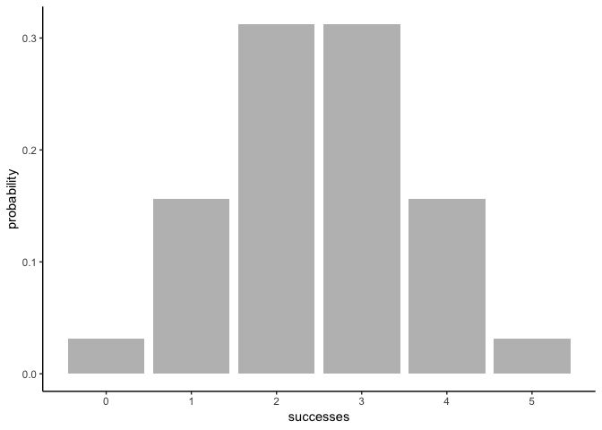
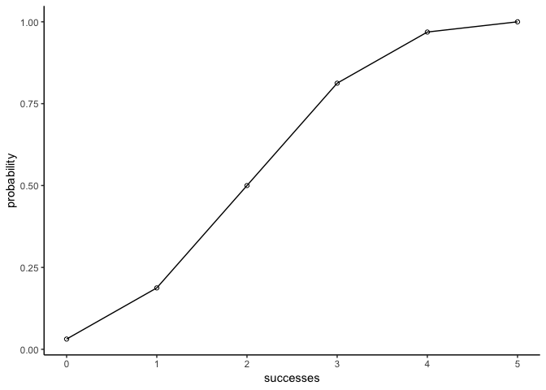

Overview
--------

`"binomial"` is a R package that provides functions to calculate probabilities of a Binomial random variable, and related calculations such as the probability distribution, the expected value, variance, etc.

-   `check_trails()` check if an input prob is a valid probability value
-   `check_prob()` check if an input trials is a valid value for number of trials
-   `check_success()` check if an input success is a valid value for number of successes
-   `aux_mean()` calculate the mean
-   `aux_variance()` calculate the variance
-   `aux_mode()` calculate the mode
-   `aux_skewness()` calculate the skewness
-   `aux_kurtosis()` calculate the kurtosis
-   `bin_choose()` calculates the number of combinations in which k successes can occur in n trials
-   `bin_probability()` calculate probabilities about the number of successes in a fixed number of random trials performed under identical conditions
-   `bin_distribution`; and `plot.bindis()` create a data frame with the probability distribution: sucesses in the first column, probability in the second column
-   `bin_cumulative`; and `plot.bincum()` create a data frame with both the probability distribution and the cumulative probabilities: sucesses in the first column, probability in the second column, and cumulative in the third column
-   `bin_var()`; and `print.binvar()`, `summary.binvar()`, `print.summary.binvar()` create a binomial random variable object
-   `bin_mean()`, `bin_variance()`, `bin_mode()`, `bin_skewness()`, `bin_kurtosis()` calculate the mean, variance, mode, skewness, and kurtosis of binomial distribution

Motivation
----------

This package has been developed to practice the creation of an R package.

Installation
------------

Install the development version from GitHub via the package `"devtools"`:

``` r
# development version from GitHub:
#install.packages("devtools")

#install "binomial" (with vignettes)

devtools::install_github("stat133-sp19/hw-stat133-AnnRuiLu/binomial", build_vignettes = TRUE, force = TRUE)
```

    ## Downloading GitHub repo stat133-sp19/hw-stat133-AnnRuiLu@master

Usage
-----

``` r
library(binomial)
library(ggplot2)

#the number of combinations in which k successes can occur in n trials
bin_choose(n = 5, k = 2)
```

    ## [1] 10

``` r
#probabilities about the number of successes in a fixed number of random trials performed under identical conditions
bin_probability(success = 2, trials = 5, prob = 0.5)
```

    ## [1] 0.3125

``` r
#create a data frame with the probability distribution: sucesses in the first column, probability in the second column
bin_distribution(trials = 5, prob = 0.5)
```

    ##   success probability
    ## 1       0     0.03125
    ## 2       1     0.15625
    ## 3       2     0.31250
    ## 4       3     0.31250
    ## 5       4     0.15625
    ## 6       5     0.03125

``` r
#plot probability distribution
plot(bin_distribution(trials = 5, prob = 0.5))
```



``` r
#create a data frame with both the probability distribution and the cumulative probabilities: sucesses in the first column, probability in the second column, and cumulative in the third column
bin_cumulative(trials = 5, prob = 0.5)
```

    ##   success probability cumulative
    ## 1       0     0.03125    0.03125
    ## 2       1     0.15625    0.18750
    ## 3       2     0.31250    0.50000
    ## 4       3     0.31250    0.81250
    ## 5       4     0.15625    0.96875
    ## 6       5     0.03125    1.00000

``` r
#plot cumulative distribution
plot(bin_cumulative(trials = 5, prob = 0.5))
```



``` r
#create a binomial random variable object    
bin_variable(trials = 5, prob = 0.5)
```

    ## "Binomial variable"
    ## 
    ## Parameters- number of trials: 5
    ## - prob of success : 0.5

``` r
#calculate the mean, variance, mode, skewness, and kurtosis of binomial distribution
bin_mean(10, 0.3)
```

    ## [1] 3

``` r
bin_variance(10, 0.3)
```

    ## [1] 2.1

``` r
bin_mode(10, 0.3)
```

    ## [1] 3

``` r
bin_skewness(10, 0.3)
```

    ## [1] 0.2760262

``` r
bin_kurtosis(10, 0.3)
```

    ## [1] -0.1238095
