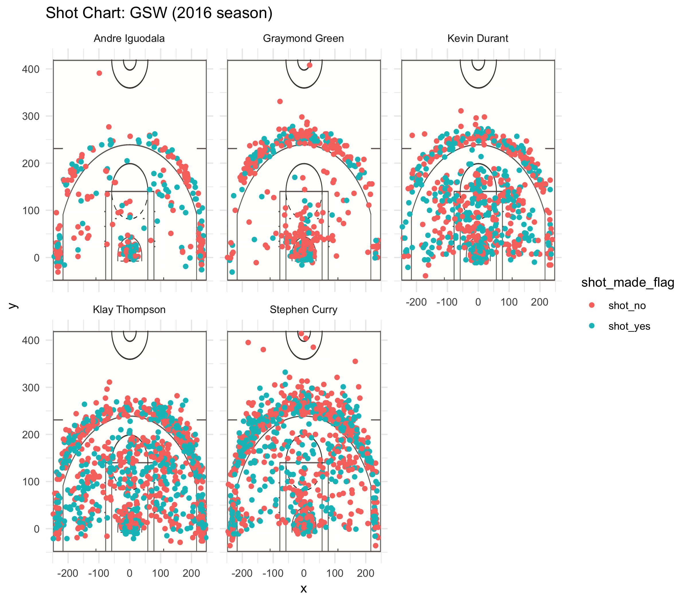

```{r, include=FALSE}
library(dplyr)
```
#Golden State Warriors: Analysis of the Team's Performance in Season 2016

###Introduction

In season 2016, GSW achieved great success with the efforts of all of its players who have various specialty. This paper highlights five of its key players -Andre Iguodala, Draymond Green, Kevin Durant, Klay Thompson, and Stephen Curry from the perspective of their shooting pattern and a deep analysis to their capability in two-point and three-point shots. 

```{r out.width='75%', echo = FALSE, fig.align='center'}
knitr::include_graphics('../../../gsw.png')
```

###Background

The Golden State Warriors are an American professional basketball team based in Oakland, California. They compete in the National Basketball Association (NBA), as a member of the league's Western Conference Pacific Division.
Winning 73 games during the 2016-17 rugular season, the Warriors posted many notable achievements. This paper will analyze the performance of its five key players -- Andew Iguodala, Graymond Green, Kevin Durant, Klay Thompson and Stephen Curry from the perspective of data.

###Data
The original data for this paper is obtained from the homework branch for UCB Statistics 133 in Github. It contains the detailed information of each point got by each of the five players respectively (Andew Iguodala, Graymond Green, Kevin Durant, Klay Thompson and Stephen Curry), including the date of game, oppoenet of the game, specific time of shot, whether the shot is made, shoot distance, action type and shot type. Based on these details, we may do various of manipulation and analysis so that we can have a insight into the performance of the Warriors in season 2016.

####Data Manipulation
+ Preliminary Manipulation to Raw Data

    (1) The five seperate csv files about the five players were imported to the command line. To better manage the 13 initial variables, the name of each player was added to each file, which would be very useful in the further analysis of these statistics.   
    (2) In the column "shot_made_flag", "n" was changed into "shot_no" and "y" was changed into "shot_yes" so that these data could be read in a more comprehensible way.    
    (3) Add a colunm named "minutes", which indicated the specific time of the shot was made. To calculate it, it multiplied the variable "period" and minused "minutes_remaining" to calculate it.
    (4) Summaries for each players were ouput as txt files so that we can have an overall view on their individual performance.    
    (5) Stack the seperate five tables into one single data frame, which would be helpfule in the further visualization and comparison of the player's performance.
      
+ Create Shot Chart for Each Player

    In this stage, the charts that illustrated the shoots taken by each player were portrayed with labels suggesting whether the shot was successfully made or not. Besides, a image of basketball court was used as the background of this chart so that it would be more meaningful and visully appealing. Furthermore, the charts for each individual player were compiled into one image, allowing us to have a better comparison of their similarities and differences in shotting patterns.

      
+ Statistical Insight into Effective Shooting Percentage

    As the decisive factor of winning or lose, it is essential to analyze the composing of the points, namely the two points and three points of each player and the effectiveness of shooting. Therefore, the tables that include the total shots, the effective shots and effective shoting percentage, were made to reach our conclusion.   


####Data Analysis

#####Shot Chart
```{r out.width='80%', echo = FALSE, fig.align='center'}

```

From the shot chart of the five players, we may firstly have an overall view on them. For Andre Iguodala and Graymond Green, their shotting centralized around the three-point line and near the rim, while Kevin Durant and Klay Thompson obviously making more shots in between. Meanwhile, Stenphen Curry was pretty good at shotting outside the three-line points. As for the effectiveness of the shot, we can find that the green area was approximately equal to the red area for all players, therefore, we would investigate it in detail in the next part with specific data.
    
Now, we may analyze each of them respectively to get more information in terms of their shooting pattern.
    
Commented as a defensive player，Andre Iguodala shot the least among the five players. His shoot might be more effective when he was at the two sides of the three-point line than when he was at the center part of three-point line.
    
For Graymond Green, he contributed greatly to the rebound as shown a centralized area of red dots in the chart, which was also in line with comments on him. Besides, he preferred to make three-point shoot in the middle of three-point line.
    
Kevin Durant, the extraordinary power forward and small forward for the team, helped the team to achieve success with his excellent and stable performance in the two-point shoots. Furthermore, his comprehensive skill in making shoots at any position of the court also enabled him to be selected to eight All-NBA teams and ten NBA All-Star teams.

As an all-round player, Klay Thompson boasted first-class capability in both three-point shoot and two-point shoot. With his professional skills and steady tactical awareness, he became a five-time NBA All-Star, a two-time All-NBA Third Team honoree, and a three-time NBA champion.
    
Stephen Curry, one of the greatest players in the basketball history, his ability in three-points shoots was absolutely impressive. Additionally, his shooting area was bigger than the rest four players, indicaiting that his tactical awareness was kind of risky but it turned out to be really uesful.

#####Effective Shooting Percentage

Firstly, let's analyze the two-point shots. From *Table 1* we could find that Andre Iguodala's shots was the most effective with a percentage of nearly 64% but we shouldn't neglect the fact that the total shots of him was the smallest so whether he was the best two-point player among the five plyaers still remained doubtful. Besides, Kevin Durant's performance in two-point shots was also impressive. He made the most two-point shots among all of them and boasted a success rate of over 60%, which might be one of the decisive factors for the winning for the team. On the other hand, Klay Thompson and Draymond Green failed to make two-point shots as good as their fellow teammates.
    
######Table1: Two Points Effective Shooting Percentage by Player   
        
```{r 1,echo=FALSE}
single_df <- read.csv("../data/shots-data.csv")
pt_2 <- single_df %>%
  group_by(name) %>%
  filter(shot_type=='2PT Field Goal') %>%
  summarise(
    total=sum(shot_type=='2PT Field Goal'),
    made=sum(shot_made_flag == "shot_yes"),
    perc_made = made / total) %>%
  arrange(desc(perc_made))

knitr::kable(pt_2)
```

Secondly, the three-point shots should also be dissected *(Table 2)*. It was obivious that Klay Thompson and Stephen Curry were extraordinary players especially in the total success shots, which were two times more than that of Durant and almost four times more than that of Iguodala and Green. And we can infer that their performance in three-point shots played a significant role in whether GSW can win the game.

######Table 2: Three Points Effective Shooting Percentage by Player
    
```{r 2,echo=FALSE, comment=""}        
single_df <- read.csv("../data/shots-data.csv")
pt_3 <- single_df %>%
  group_by(name) %>%
  filter(shot_type=='3PT Field Goal') %>%
  summarise(
    total=sum(shot_type=='3PT Field Goal'),
    made=sum(shot_made_flag == "shot_yes"),
    perc_made = made / total) %>%
  arrange(desc(perc_made))

knitr::kable(pt_3)
```

Thirdly, we can analyze the overall effectiveness of their shots with both 2-point and 3-point shots included. As shown in *Table 3*, Durant boasted the highest made-shot percentage which might be attributed to his high accuracy in two-point shots and stable performance in three-point shot. Besides, Curry was the core player who shot most. However, when we dig into this table, we may realize that it can show the accuracy of their shoots but can't give a precise measurement of the player's contribution to the team.

######Table 3: Effective Shooting Percentage by Player
    
```{r 3,echo=FALSE}         
single_df <- read.csv("../data/shots-data.csv")
pt_eff <- single_df %>%
  group_by(name) %>%
  filter(shot_type=='2PT Field Goal'|shot_type=='3PT Field Goal') %>%
  summarise(
    total=sum(shot_type=='2PT Field Goal'|shot_type=='3PT Field Goal'),
    made=sum(shot_made_flag == "shot_yes"),
    perc_made = made / total) %>%
  arrange(desc(perc_made))

knitr::kable(pt_eff)
```

To solve this question, *Table4* were made to compare the value of teo-point shot and three-point shot. We may find that although  the effectiveness of two-point shot is about 1.5 times higher than three-point shot, this not necessarily means that two-point shots boasts higher "price ratio" because when you mutiply the "shot_type" by 2 and 3 respectively, you may find that actually they are aproximately of the same value.

######Table 4: Comparison of Value of Two-point Shot and Three-point Shot   

```{r 4,echo=FALSE}        
single_df <- read.csv("../data/shots-data.csv")
pt_2more <- single_df %>%
  group_by(name) %>%
  filter(shot_type=='2PT Field Goal') %>%
  summarise(
    total=sum(shot_type=='2PT Field Goal'),
    made=sum(shot_made_flag == "shot_yes"),
    two_perc_made = made / total,
    two_points_made = made*2/total) %>%
  select(name,two_perc_made,two_points_made)%>%
  arrange(desc(two_perc_made))

knitr::kable(pt_2more)
```

```{r 5,echo=FALSE}
pt_3more <- single_df %>%
  group_by(name) %>%
  filter(shot_type=='3PT Field Goal') %>%
  summarise(
    total=sum(shot_type=='3PT Field Goal'),
    made=sum(shot_made_flag == "shot_yes"),
    three_perc_made = made / total,
    three_points_made = made*3/total) %>%
  select(name,three_perc_made,three_points_made)%>%
  arrange(desc(three_perc_made))

knitr::kable(pt_3more)
```

Fianlly, let's compare those three tables together. We can see that there is no clear relationship between the amount of an individual player's two-point shoots and three-points shoots; in other words, whether they shot more two-point or three-point goals all depends on their own speciality. Furthermore, we can infer that there might not be a perfect player and it is the teamwork of all those players that lead to the GSW's great success in 2016.

###Conclusions

From the previous analysis, we can conclude that Durant and Curry, who have comprehensive skills, are definitely the core of the whole team while Thompson, Green and Iguodala, who have their highlights in either two-point shots or three-point shots, are also an indespensable part for GSW. The team can't achieve success without the efforts and cooperation of every team member. 

###Reference
https://en.wikipedia.org/wiki/Golden_State_Warriors   
https://en.wikipedia.org/wiki/Andre_Iguodala    
https://en.wikipedia.org/wiki/Stephen_Curry   
https://en.wikipedia.org/wiki/Kevin_Durant    
https://en.wikipedia.org/wiki/Klay_Thompson   
https://en.wikipedia.org/wiki/Draymond_Green    